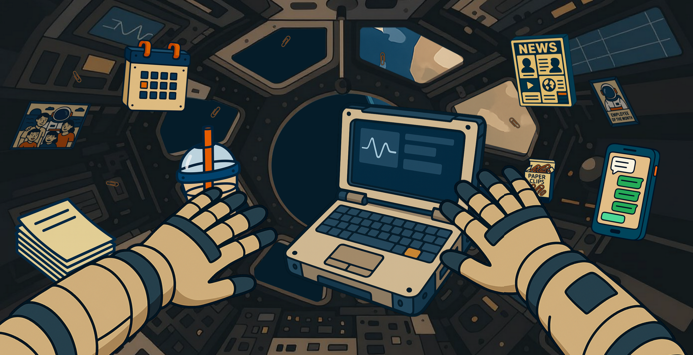

# CSS Art: Office Culture — SPACE Edition

## Overview

This project is my submission for the **CSS Art: Office Culture** prompt in the [Frontend Challenge: Office Edition](https://dev.to/challenges/frontend/axero), sponsored by Axero. It reimagines office life aboard the **International Space Station**, blending sci-fi aesthetics with workplace interactivity.

[Live website](http://dev.to.aurelienj.ch)

## Concept

The homepage features a fully CSS interior of the ISS, with a panoramic view of Earth. It captures the spirit of remote collaboration in extreme environments—where calendars, messages, and news updates float alongside orbital serenity.

## Ai

All drawings were created using Copilot AI.

## Tech Stack

- HTML5
- CSS3 (no preprocessors)

## Judging Criteria Alignment

- **Accessibility**: Uses semantic HTML to support basic accessibility without additional frameworks
- **Creativity**: Presents a unique and imaginative interpretation of office culture—set aboard the ISS!
- **Code Quality**: Fully built with efficient, well-structured HTML and CSS only—no fluff, no dependencies

## Author

Created by Aurelien404  
Sketches assisted by **Copilot AI**
